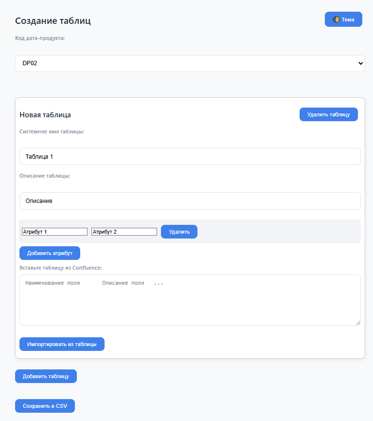

# Генератор CSV в браузере офлайн

> Простой офлайн-интерфейс на HTML+CSS+JS для описания таблиц и атрибутов.  
> Работает без интернета и зависимостей — **подходит для закрытых контуров**

## 📌 Что делает

- Позволяет описывать таблицы и их поля,
- Поддерживает вставку из Confluence-таблиц,
- Генерирует стандартизированный CSV



## Как использовать

1. Открой `index.html` в браузере
2. Выбери код дата-продукта
3. Нажми "Добавить таблицу", заполни поля
4. Добавь атрибуты вручную или вставь таблицу из Confluence
5. Нажми "Сохранить в CSV" — получишь `table_data.csv`

---

## Формат CSV

Разделитель: `;`

Столбцы:

- data_product
- table_name
- table_description
- attribute_name
- attribute_description

Пример:

```csv
data_product;table_name;table_description;attribute_name;attribute_description
"DP01";"clients";"Список клиентов";"client_id";"Уникальный ID"
```

## Особенности

- 💡 Темная/светлая тема (переключается кнопкой)
- 🛡 Безопасен: работает локально, ничего не отправляет
- Импорт из Confluence по колонкам `Наименование поля`, `Описание поля`
- Встроенные проверки на заполненность полей

## Зачем такое нужно

- Нет нужды в бэкенде и npm - работает на любом ПК одним кликом
- Подходит для стандартизированных файлов от широких команд в закрытом контуре
- Позволяет быстро заполнять и собирать стандартизированные CSV для дальнейшей обработки

---

Есть идея как улучшить? Создавай Issue и реализуем 😉
